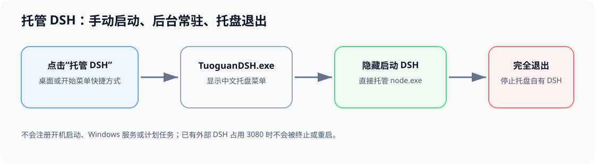
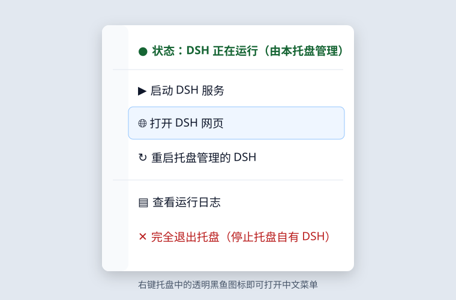

# 托管 DSH（Tuoguan DSH）


把 `dsh web` 变成一个真正的 Windows 系统托盘应用：点击快捷方式后，DSH 在后台隐藏运行；关闭 CMD、PowerShell 或 Windows Terminal 不会再把 DSH 一起关掉；需要停止时，从右下角托盘菜单选择“完全退出”。

> 本项目不是 DeepSeek 官方组件。它是面向 Windows 的轻量托盘包装器，调用你本机已安装的 `@deepseek-ai/dsh`。



## 功能

- **一键启动**：点击桌面或开始菜单中的“托管 DSH”，立即启动托盘程序和 `dsh web`。
- **无 CMD 窗口**：直接使用 `node.exe` 启动 DSH，不创建需要保留的命令行窗口。
- **系统托盘常驻**：右下角显示透明背景的 DeepSeek Harness 黑鱼图标。
- **中文右键菜单**：查看运行状态、打开网页、启动/恢复、重启、查看日志、完全退出。
- **安全的进程所有权**：只会停止或重启本托盘自己创建的 DSH；如果端口 `3080` 已由其他 DSH 使用，不会误杀其他工作流。
- **不会开机自启动**：安装器不创建计划任务、服务、注册表 `Run` 项或启动文件夹项。只有手动点击快捷方式才运行。
- **异常可观测**：托盘日志和 DSH 输出保存在安装目录的 `logs` 文件夹。
- **透明高清图标**：提供 16、20、24、32、40、48、64、128、256 像素的多尺寸 ICO。

## 界面示意



菜单顶部会根据情况显示：

- `状态：DSH 正在运行（由本托盘管理）`
- `状态：检测到其他实例正在运行`
- `状态：DSH 未启动`
- `状态：启动失败（可查看运行日志）`

“完全退出托盘”使用红色强调；该操作会关闭托盘，并且只停止本托盘自己启动的 DSH。

## 系统要求

- Windows 10 或 Windows 11；
- 已安装 Node.js 和 npm；
- 本机已有可正常使用的 DSH。

> 本项目只负责托盘托管，不包含 DSH 本体。

## npm 一键安装（推荐）

面向普通用户的三种安装方式按可靠性排序为：**npm registry（发布后）> GitHub tarball > PowerShell 在线安装脚本**。

### 1. npm registry（发布后，最可靠）

若已发布到 npm registry，使用：

```powershell
npm install -g --allow-scripts=tuoguan-dsh tuoguan-dsh
```

需要 `--allow-scripts=tuoguan-dsh`，以便 npm 允许运行本包的 `postinstall` 安装脚本；不需要 `--allow-remote`。

### 2. GitHub tarball（当前推荐）

当前可以直接从 GitHub 的 HTTPS tarball 安装：

```powershell
npm install -g --allow-scripts=tuoguan-dsh https://github.com/scutjerry/tuoguan-dsh/archive/refs/heads/main.tar.gz
```

该方式不需要 Git。npm 12 如果默认阻止远程 tarball，还需要加入 `--allow-remote=all`：

```powershell
npm install -g --allow-scripts=tuoguan-dsh --allow-remote=all https://github.com/scutjerry/tuoguan-dsh/archive/refs/heads/main.tar.gz
```

> ⚠️ **请勿使用** `npm install -g github:scutjerry/tuoguan-dsh`。`github:` 简写会调用 Git；在 npm 全局安装 git 依赖时，npm 还会为 git 依赖派生一个继承全局配置与 prefix 的 `npm install`，可能与外层安装互相 retire 文件，最终留下残缺的包。这是 npm 的全局 git 依赖安装行为，不是本项目的 C# 程序或安装脚本故障；请改用上面的 registry 或 HTTPS tarball 写法。

npm 安装会运行生命周期脚本，并自动：

1. 安装或更新托盘程序到 `%LOCALAPPDATA%\Programs\TuoguanDSH`；
2. 在桌面和开始菜单创建 `Tuoguan DSH` 快捷方式；
3. 注册 `tuoguan-dsh` 命令；
4. **不会**配置开机自启动、计划任务或 Windows 服务。

安装后可以双击桌面上的 `Tuoguan DSH`，或者运行：

```powershell
tuoguan-dsh
```

如果 npm 的安全策略跳过了生命周期脚本，但已经安装了 CLI，可以手动完成托盘程序与快捷方式安装：

```powershell
tuoguan-dsh install
```

查看命令帮助：

```powershell
tuoguan-dsh --help
```

### npm 卸载

先清理托盘程序和快捷方式，再移除 npm 包：

```powershell
tuoguan-dsh uninstall
npm uninstall -g tuoguan-dsh
```

之所以分成两步，是因为部分 npm 版本在全局卸载时不会执行包的卸载生命周期脚本；显式运行 `tuoguan-dsh uninstall` 可以确保清理完整。

## PowerShell 在线安装（无 npm 兜底）

这是上述可靠性顺序中的第三种方式，不依赖 npm，因此也不需要 `--allow-scripts`：

```powershell
irm https://raw.githubusercontent.com/scutjerry/tuoguan-dsh/main/install-online.ps1 | iex
```

## 从源码手动安装（开发者）

```powershell
git clone https://github.com/scutjerry/tuoguan-dsh.git
cd tuoguan-dsh
powershell -NoProfile -ExecutionPolicy Bypass -File .\install.ps1
```

如果系统执行策略阻止脚本，使用上面显式提供的 `-ExecutionPolicy Bypass` 即可；它只影响本次 PowerShell 进程，不会永久修改系统策略。

## 使用教程

### 1. 启动

双击桌面或开始菜单中的：

```text
Tuoguan DSH
```

启动后不会出现 CMD 窗口。Windows 可能把新图标放在任务栏右下角的 `^` 隐藏区域中；可将黑鱼图标拖到外面固定显示。

### 2. 打开 Web GUI

- 双击托盘黑鱼图标；或
- 右键图标，选择“打开 DSH 网页”；或
- 浏览器访问 <http://127.0.0.1:3080>。

### 3. 重启

右键图标，选择“重启托盘管理的 DSH”。只有本托盘启动的实例才能被重启；外部实例会被保护。

### 4. 完全退出

右键图标，选择：

```text
完全退出托盘（停止本托盘启动的 DSH）
```

这会同时退出托盘程序，并停止它自己启动的 DSH。关闭其他 CMD、PowerShell 或 Terminal 窗口不会影响托盘中的 DSH。

## 卸载

从仓库目录执行：

```powershell
powershell -NoProfile -ExecutionPolicy Bypass -File .\uninstall.ps1
```

如果通过 npm 安装，推荐执行：

```powershell
tuoguan-dsh uninstall
npm uninstall -g tuoguan-dsh
```

也可以直接从安装目录执行：

```powershell
powershell -NoProfile -ExecutionPolicy Bypass -File "$env:LOCALAPPDATA\Programs\TuoguanDSH\uninstall.ps1"
```

保留日志：

```powershell
powershell -NoProfile -ExecutionPolicy Bypass -File "$env:LOCALAPPDATA\Programs\TuoguanDSH\uninstall.ps1" -KeepLogs
```

## 实现方式

### 进程托管

`TuoguanDSH.exe` 是一个基于 .NET Framework WinForms 的小型 `winexe`：

1. 安装器创建手动快捷方式；
2. 用户点击快捷方式后启动 `TuoguanDSH.exe`；
3. 程序自动定位 `node.exe` 和 npm 全局目录下的 DSH `lib/bin.js`；
4. 通过 `ProcessStartInfo` 直接运行：

   ```text
   node.exe <DSH安装目录>\lib\bin.js web
   ```

5. `UseShellExecute=false`、`CreateNoWindow=true`，因此不会显示 CMD；
6. 托盘持有子进程对象，并重定向标准输出/错误到日志；
7. 只有菜单中的“完全退出”或“重启”会操作托盘自己拥有的子进程。

### 外部实例保护

程序会探测 `127.0.0.1:3080`：

- 如果端口空闲，启动并拥有新的 DSH；
- 如果端口已被占用，显示“检测到其他实例”，但不终止、不重启、不接管该进程；
- 这样可以避免影响另一个项目或工作流中正在运行的 DSH。

### 单实例与托盘

程序使用命名互斥锁避免重复托盘图标；WinForms `NotifyIcon` 提供菜单和状态提示。透明黑鱼图标同时嵌入 EXE 并作为快捷方式图标。

### 隐私与本地数据

本项目：

- 不上传日志；
- 不采集遥测；
- 不读取 DSH 对话内容；
- 不保存 Token 或 API Key；
- 所有运行日志仅保存在本机安装目录的 `logs` 下。

## 构建与测试

构建：

```powershell
powershell -NoProfile -ExecutionPolicy Bypass -File .\build.ps1
```

运行静态与构建冒烟测试：

```powershell
powershell -NoProfile -ExecutionPolicy Bypass -File .\tests\smoke-test.ps1
```

包括安装/卸载测试：

```powershell
powershell -NoProfile -ExecutionPolicy Bypass -File .\tests\smoke-test.ps1 -IncludeInstallTest
```

GitHub Actions 会在 `windows-latest` 上自动构建和测试，并上传便携构建产物；推送与 `package.json` 版本一致的 `v*` tag 时，发布 job 会重新构建、校验发布产物，并使用仓库中的 `NPM_TOKEN`（作为 `NODE_AUTH_TOKEN`）发布公开包，同时通过 GitHub OIDC 生成 provenance。

## 故障排查

### `npm error enoent ... syscall spawn git`

这表示系统没有安装 Git，而 `github:` 简写必须调用 Git。不要为本项目改用该简写；直接使用上文的 npm registry 或 GitHub HTTPS tarball 命令，tarball 安装不需要 Git。

### `Cannot find module ...\scripts\npm-postinstall.js`

这通常是 npm 全局安装 git 依赖时，内外两层安装共享全局 prefix 并互相 retire 文件后留下了残缺包。它属于 npm 的全局 git 依赖安装行为，不是托盘程序或 `install.ps1` 的问题；请清理失败安装后，改用上文的 HTTPS tarball 写法。

### `npm warn install-scripts`

npm 11.16+ 正在收紧供应链安全默认值，需要通过 `--allow-scripts=tuoguan-dsh` 明确允许运行本包的安装脚本。npm 12 使用 HTTPS tarball 时，如果远程来源也被默认拦截，再加入 `--allow-remote=all`；若包已安装但脚本被跳过，可运行 `tuoguan-dsh install` 手动完成安装。

### 点击后没有图标

1. 点击任务栏右下角的 `^`；
2. 检查任务管理器中是否存在 `TuoguanDSH.exe`；
3. 查看 `%LOCALAPPDATA%\Programs\TuoguanDSH\logs\dsh-tray.log`。

### 状态显示“启动失败”

确认 Node.js 与本机已有的 DSH 都可以正常运行，并打开托盘菜单中的“查看运行日志”获取详细错误。该托盘项目不负责安装或配置 DSH 本体。

### 端口 3080 已占用

托盘会保护已有实例，不会强制结束它。可以关闭原来的 `dsh web`，然后从托盘菜单选择“启动 DSH 服务”；也可以继续使用该外部实例。

### 快捷方式图标未刷新

Windows 资源管理器可能缓存旧图标。重新打开文件夹或重启资源管理器后会显示透明背景黑鱼图标。

## 项目结构

```text
src/DSH-Tray.cs           WinForms 托盘程序源码
assets/                   透明黑鱼图标与来源 SVG
build.ps1                 可复现构建脚本
install.ps1               本地安装脚本
install-online.ps1        PowerShell 在线安装入口
package.json              npm 包元数据和生命周期脚本
scripts/                  npm CLI、安装与卸载桥接脚本
uninstall.ps1             卸载脚本
tests/smoke-test.ps1      冒烟与安装/卸载测试
docs/                     README 示意图
.github/workflows/         Windows CI
```

## License

MIT
